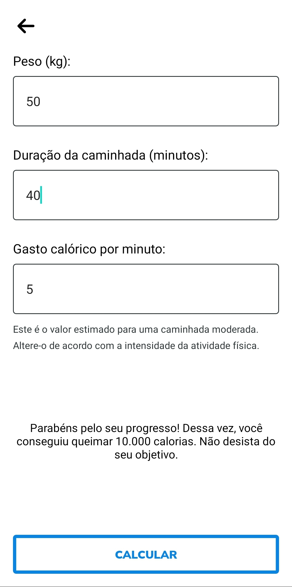

# muzy-simple-calc

## Sumário

- [muzy-simple-calc](#muzy-simple-calc)
  - [Sumário](#sumário)
  - [Motivação](#motivação)
  - [Pilha de tecnologia](#pilha-de-tecnologia)
  - [Galeria](#galeria)
  - [Como rodar](#como-rodar)
    - [Pré-requisitos](#pré-requisitos)
    - [Passo a passo](#passo-a-passo)

## Motivação

Este app é uma ferramenta essencial para os entusiastas do condicionamento físico e do culturismo. Projetado para aprimorar o progresso e a saúde dos praticantes de musculação, o app oferece uma calculadora de Taxa de Metabolismo Basal (TMB) que desvenda os segredos da nutrição direcionada ao crescimento muscular e à preservação da massa magra durante os intensos treinamentos.

Ao considerar elementos vitais, como peso, altura e idade, a calculadora de TMB produz um cálculo meticuloso das calorias diárias ideais para cada indivíduo, tornando-se uma bússola confiável na jornada rumo aos objetivos físicos.

Além desse recurso crucial, o app também disponibiliza uma calculadora de calorias queimadas durante caminhadas. Embora essa funcionalidade simplificada, multiplicando peso, duração da caminhada e gasto calórico por minuto, possa subestimar algumas variáveis complexas, ela oferece uma estimativa aproximada, permitindo aos usuários entenderem o impacto de suas atividades cotidianas.

No entanto, reconheço que a implementação deste app foi feita sob limitações de tempo, resultando em trechos de código repetidos e evitando algumas práticas ideais de desenvolvimento. Enquanto o código pode não refletir todas as convenções desejadas, a utilidade e potencial transformador deste app permanecem evidentes.

Este foi o segundo repositório de código apresentado no [Curso Superior de TSI](https://www.ifms.edu.br/campi/campus-aquidauana/cursos/graduacao/sistemas-para-internet/sistemas-para-internet) do IFMS como requisito para obtenção da nota parcial das atividades da unidade curricular Programação para Dispositivos Móveis II.

| [&larr; Repositório anterior](https://github.com/mdccg/spotify-clone) | [Próximo repositório &rarr;](https://github.com/mdccg/reddit-clone) |
|-|-|

## Pilha de tecnologia

| Papel | Tecnologia |
|-|-|
| Ambiente de execução | [Node](https://nodejs.org/en/) |
| Plataforma | [Expo](https://expo.dev/) | 
| Linguagem de programação | [JavaScript](https://developer.mozilla.org/pt-BR/docs/Web/JavaScript) |
| Front-end | [React Native](https://reactnative.dev/) |

## Galeria




## Como rodar

### Pré-requisitos

- [Node](https://nodejs.org/en/download/);
- [Yarn](https://yarnpkg.com/) (opcional);
- Dispositivo móvel:
  - [Expo Go](https://expo.dev/client).

### Passo a passo

1. Clone o repositório de código em sua máquina;
   
2. Abra um shell de comando de sua preferência (prompt de comando, PowerShell, terminal _etc_.);
   
3. Instale as dependências do projeto através do seguinte comando:

```console
$ npm install
```

Caso esteja utilizando o gerenciador de pacotes Yarn, execute o seguinte comando como alternativa:

```console
$ yarn
```

4. Execute o seguinte comando para iniciar o app:

Para npm:

```console
$ npm run start
```

Para Yarn:

```console
$ yarn start
```

5. Uma vez iniciado, aparecerá um QR Code. Você deve escaneá-lo com o aplicativo [Expo Go](https://expo.dev/client), disponível para Android e iOS;

6. Como alternativa, você pode executar o app no seu navegador, pressionando o atalho `w`. Entretanto, alguns módulos podem não funcionar na versão web do app;

7. Exclusivamente para este repositório de código, você pode executar uma versão similar no meu _snack_[<sup>1</sup>](#nota-de-rodape-1) [mdccg/calculadora-da-saude-tsi](https://snack.expo.dev/@mdccg/calculadora-da-saude-tsi).

<sup id="nota-de-rodape-1">1</sup> _Snack_ refere-se a um recurso do site da Expo onde os desenvolvedores podem criar, visualizar e compartilhar trechos de código-fonte em tempo real usando um ambiente de desenvolvimento on-line. Esses trechos de código-fonte geralmente contêm exemplos de como implementar recursos específicos no React Native, e os usuários podem testá-los instantaneamente em seus próprios dispositivos móveis, sem precisar configurar um ambiente de desenvolvimento em seu computador.
